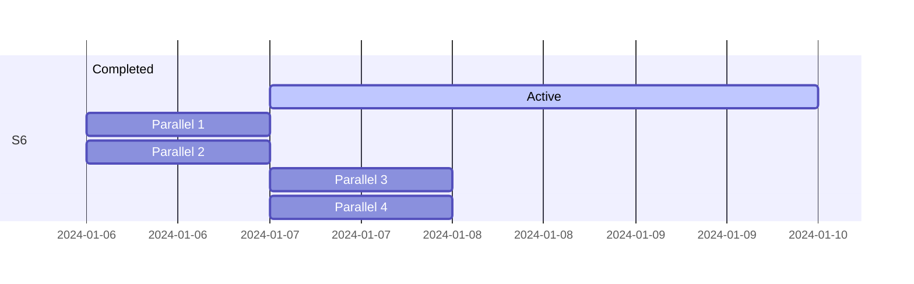

# Projet Majeur de Conception

## 1. Session 6 - Été 2024

### 1.1 Planification

Gestion de PMC avec un PLM de type MVP. Utilisation des outils comme  gantt... Toute la documentation se fera avec des fichier texte simple (markdown ou autre) pour éviter la dépendace au outils propriétaire. Tous graphiques seront au fromat .svg fait avec draw.io ou avec l'aide de [mermaid](https://github.com/mermaid-js/mermaid/tree/develop).

exemple de gants tirée de mermaid

### 1.2 Test préliminaire du niveau physique

Réaliser des tests pour choisir le niveau physique que SHER-Bus repose. Puisque c'est sr quoi repose tous ce que nous batirons nous devos s'assurer le plus tôt possible. les possiblitée sont M-LVDS,LVDS,B-LVDS, émulation de paire différentielle par io cmos. Nous devons faire ce travail avant de commencer a écrire la spécification car la spec dépend du niveau physique.

D'un autre côté, il faut évaluer la possibilitée d'ajout d'une *shear bolt* dans le bus (probablement un end bridge SHER-Bus2SHER-Bus). En effet, un des problème des comunication sur Bus (I2C,CAN, etc) est que si un circuit brise il amène toute la communication avec lui. Il faut ajouter une mesure pour que le bus fail de manière controlée et determinée. Cela permet de faciliter la réparation et le diagnostic des produit comportant SHER-Bus et diminuer l'obsolescence programmée.

### 1.3 spécification

La spécification est le livrable le plus important du projet. Il permet a n'importe qui d'implémenter notre projet. C'est pour cela qu'elle doit être écrite le plus rapidement possible. la Session 7 permettra de valider la faisabilitée de la spécification.

### 1.4 Dévelopement d'Outils

Aucun outil n'est actuellement disponibles pour dévemiller un BUS SHER-Bus. Nous devons donc les créer. Pour ce faire nous devon nous mettre au plus vite a la création de ces outils. Il y a un simulteur de tramme python, un décodeur pour analyseur logique, et un générateur de séquence pseudo aléatoire.

#### 1.4.1 Simulateur python

Conception d'un convertisseur de trame binaire a un signal discrétisée dans le temps. 

#### 1.4.2 Décodeur [Sigrok/PulseView](https://sigrok.org/wiki/PulseView)

Pour vérifier l'intégritée des messages, il va falloir utiliser un décodeur. cette tache peut-etre fait a la main, mais elle est fastidieuse. Un programme qui convertis un trains de bits en information facilement lisible aide au débogage. [Le simulateur Python](https://github.com/cdg66/SHER-Bus/edit/add-PMC.md/PMC.md#141-simulateur-python) sera utilisée pour valider le décodeur.

#### 1.4.3 Générateur de *pseudorandom binary sequence (PRBS)*

Pour des test de bas niveau il va falloir vérifirer l'intégritée du diagramme en oeuil (*eye diagram* en anglais). La concepton sur RP2040 d'un PRBS vas nous permettre de facilement vérifirer les problème liée au paires croisée.

## 2. Automne 2024

### 2.1 Publication de la spécification et retour de la communautée open source

Lors du stage T4 la spécification sera publiée et la communautée open source sera invitée a discuter du projet. Elle sera invitée a proposer différent type d'application que le SHER-Bus pourrait suporter en plus de ceux déja pensée par l'équipe. Cela permet de vérifier l'intéret de la communautée. Cela permet aussi de vérifier si nontre spécification n'enfreins pas de brevet. Il serait domage de commencer la conception juste pour se faire dire que nous enfreinions le brevet de XYZ compagnie.

--- 
> "Given enough eyeballs, all bugs are shallow"
>    - Eric S. Raymond [^1]                   
--- 
[^1]:  Raymond, Eric S. "The Cathedral and the Bazaar". catb.org.

## 3. Session 7 - Hiver 2024

Vu que c'est un projet elec-info il y a évidememt deux partie au projet. Chaque partie peux-etre décomposée en sous partie suivanntes. Chaque sous partie peux ou pas être dépendantes des précédente.

### 3.1 Partie Matérielle

#### 3.1.1 Banc de Test

Il s'agit du Pcb qui vas permettre l'interconnection des différent appareil sur le bus. il permetta aussi le Débugage/programmation simultanée de plusieur MCU.

#### 3.1.2 Carte controleur/Bridge

Carte pouvant se connecter sur le banc de test. Elle contient un controlleur(RP2040 mcu) et un bridge(ICE40 fpga) soit les appareil minimal pour faire un bus. Cette carte pourras être ensuite distribuée pour que de futur implémenteur puisse aprivoiser le nouveau bus.

### 3.2 Partie Logicielle

#### 3.2.1 VHDL PHY (Xilinx/Lattice)

Le PHY ou plus communément le  Milieux Phisique gère la comunication au niveau fillaire. Il permet la sérialisation et déserialisation des message. 

#### 3.2.2 VHDL AXI2SHER-Bus (Xilinx)

Avec une carte Zybo concevoir un Périférique AXI pour CPU(arm ou microblaze). Le PHY est réutilisée avec l'ajout des masques et interuption

#### 3.2.3 VHDL Bridge (Lattice)

Pont entre protocol basse vitesse (i2c,spi,i2c, etc). ce pont va etre utilise pour la Carte controleur/Bridge. 

#### 3.2.4 PIOasm Contrôleur (RP2040)

milieux phisique émulée par les pio.

#### 3.2.5 C/C++ SHER-Bus middleware (RP2040/Xilinx)

Le middleware est la partie logicielle qui permet la gestions des messages envoyée et recus. Elle devrais être commune autant pour le RP2040 que pour le FPGA xilinx. seul le plus bas niveau doit être adaptée a cpu.

#### 3.2.6 C/C++ USB2SHER-Bus end-bridge (RP2040)

Vu que le RP2040 possède un port usb device il serait intéressant de faire un end bridge.

## 4. Session 8 - Été 2025

### 4.1 conception d'un produit démo pour MégaGéniale

Bien qu'un la conception d'un bus 100% __*opensource*__ soit très intéressante, il est fort problable que cela captive pas l'attention du citoyen lambda. Avec tout ce qui a été concu avec la S7, la S8 sera consacrée a la production d'un produit démo ( bras robotisée, imprimante 3D, CNC, Casque audio, Grappe de serveurs [cluster-computer] ,etc,) utilisant SHER-Bus comme technogie principale. Le but est de montrer la technologie dans son meilleur état. le but étant aussi de faire découvrir au concepteur d'électronique la puissance de ce Bus comparée au alternative. 

